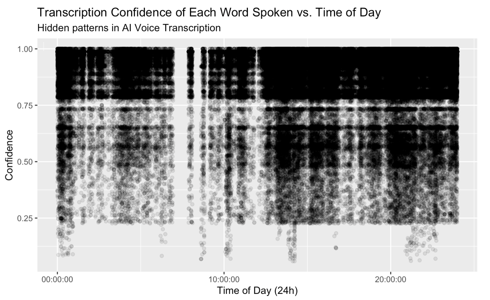
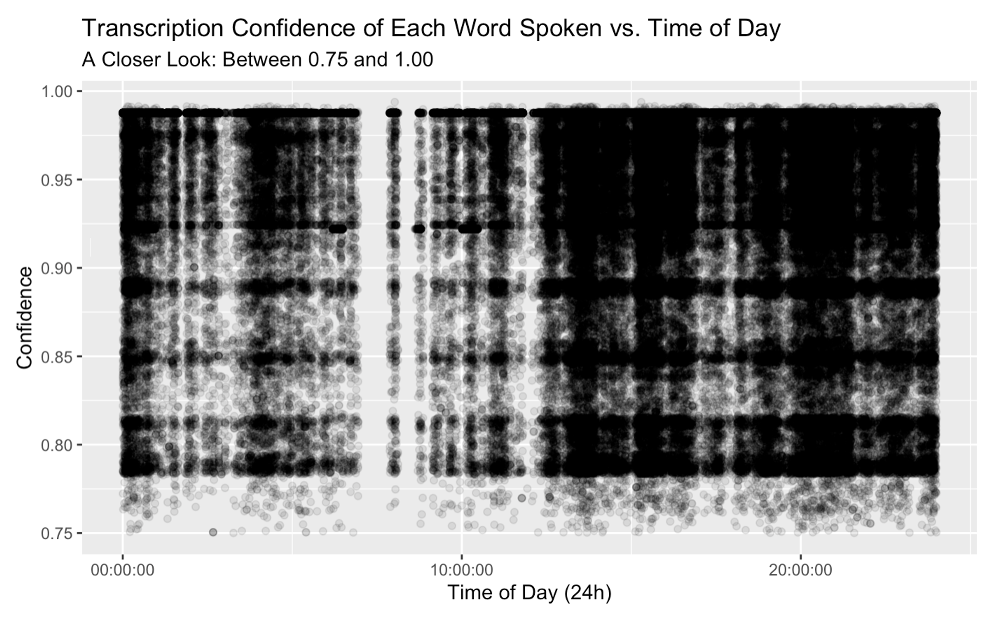

# A Simple Portfolio for The Atlantic

Above, you will find folders with some of my literary and creative work undertaken between the ages of 18 and 22. The linked folder—*Unsupervised Emotion Clustering*—will redirect you to another page containing an example of my research at the intersection of machine learning, psychology, and linguistics. Though this research might be less interesting for a casual onlooker, I wish to demonstrate my familiarity working in the mode of conference-grade, peer-reviewed scientific papers in the areas of Technology and Health. As I have yet to publish the results for my most recent 2-year research project, I will include a brief synopysis of it below.

## Current Research: Modeling Psychological Phenomena Through a Personal Language Corpus

### GPT-ME: Creating a Second Self

Deep in the impenetrable silence of the first year of COVID, I began to see a therapist over Zoom. Like many others, the lack of external motion—of novelty and of progress—forced me into a confrontation with a self that I had sequestered deep within, a self that spoke like a phantasm from the darkest parts of the night. It was an incapacitating encounter that I was not prepared for, so therapy seemed to be a good option. During our sessions, the therapist pushed me to ressusitate that voice and the memories it brought to the surface. Yet every time I began to speak about myself, I found myself narrativizing, painting, in short, creating a self to be therapized, prescriptively rendering a person called "Axel" to my interlocutor rather than letting my subconscious free. I began to wonder if that voice, that internal voice, could be captured and interrogated abscent my mediation.

As a newly trained machine learning engineer, I began to realize that this naive hope was no longer out of reach. Every day, we produce immense amounts of language. If I could capture this language, I could train a language model on my own linguistic output. Since then, I have recorded over 10 months of my life using a hidden lavalier microphone attached to my collar. Processing the audio files using a speech diarization/transcription pipeline, I have generated documents representing the entirety of my language context. Everything I said during those 10 months—every conversation, every word—now populated a dataframe that was machine-readable. Fine-tuning several language models on this corpus, I forged my very own Frankenstein. One that spoke my language.

This alter-ego I created demonstrated an uncanny ability to extend my thoughts into areas that I have not previously reflected on. It could sample my language probabilistically, generating hypothetical responses to my inquiries and offering me a view into the deepest annals of my subconscious. My communication with this model has helped me understand myself to a greater degree than any work of literature ever has. The potential of these models offer an avenue of inquiry that I believe to be of ethical, philosophical, and psychological import. Of course, my results remain speculative (steeped, as it is, in confirmation bias), and so I am currently pursuing IRB approval for a comparative study.

Though I have explored the literary implications of such models in my thesis, *Language in the Age of Artificial Intelligence* (linked above), I am still working on papers in a more scientific mode that I hope to publish within the year.

### Linguistic Fingerprints
Another approach to the same question of lingusitic representation has to do with what I dub “linguistic fingerprints” and comprises another area of the same research. While analyzing the entirety of my language context, I noticed a remarkable pattern emerging. See the graph below: 

On this graph, every single word I spoke during my recording process was mapped onto the exact time of day it was spoken and the confidence of the artificial intelligence transcriber. What emerges once (one takes up the transparency of the over 400,000 words plotted) are distinct intervals in the distribution (those horizontal lines), that remain uniform regardless of the time of day. Zooming into the black blotch at the top, we see the pattern continues fractally:

These areas of high density, taken together (think a bar code) create a distribution that uniquely identifies me and my linguistic context—at least so I hypothesize. I wish to further research this finding, and more generally the capabilities of AI to recognize and create these potential cyphers/identities codes. If my hypothesis is correct, not only would this constitute a new form of identification, but it would prove the unique nature of an individual’s linguistic context.
